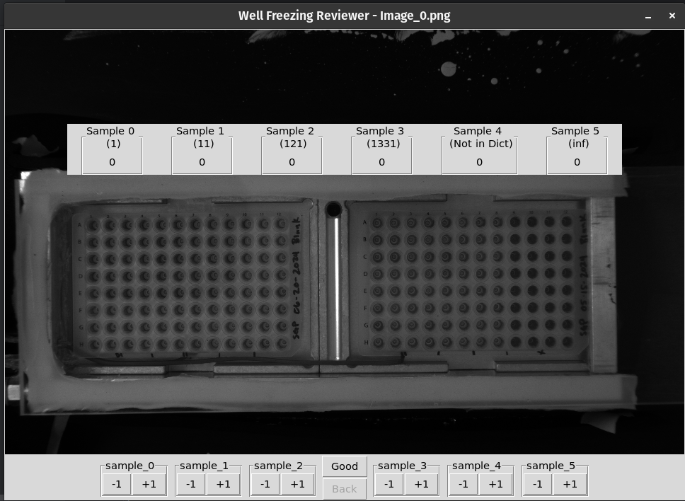

# OLAF
OpenSource Library for Automating Freezing data acquisition from Ice Nucleation Spectrometer (OLAF DaQ INS).
Documentation can be found [here](https://sigran.github.io/OLAF/).
## Getting Started
 This project's virtual environment and dependencies are managed by [uv](https://docs.astral.sh/uv/). 

### Background information
When working with many different Python projects, it is highly recommended to use a 1) virtual environment and 2) a package manager.
1) A virtual environment is a self-contained directory that contains a Python installation for a particular version of Python, plus a number of additional packages.
2) A package manager is a tool that automates the process of installing, upgrading, configuring, and removing packages inside a virtual environment.

There are multiple options to manage versions of python and packages, but this project uses one package and project manager, [uv](https://docs.astral.sh/uv/).

note: There's also a requirements.txt

### Pre-requisites
Find and follow instructions online for installing the following:
1. [Python](https://www.python.org/downloads/)
2. [Git](https://git-scm.com/downloads)
3. Optional: [Pycharm](https://www.jetbrains.com/pycharm/download/)

Please note that pycharm is not required to use this project. Feel free to use your favorite IDE or text editor.
To make installation as beginner-friendly as possible, we use pycharm to simplify the installation process. If you are
more familiar with installing software packages and setting up your environment, you should be able to find the parts
in these instructions to install it without pycharm.

### Installation
#### Install uv on windows
Install uv with pipx:
1. Open windows powershell and verify that python is installed on your computer.
```bash
py --version
```


2.Then run the following command to install pipx for your user:
```bash
py -m pip install --user pipx"
```
3. Ensure that the pipx directory is added to PATH (more information on this [here](https://phoenixnap.com/kb/add-python-to-path)).
```bash
py -m pipx ensurepath
```
4. Close and re-open powershell for the PATH changes to take effect.
5. Install uv with pipx.
```bash
py -m pipx install uv
```


6. Check which versions of python are available to install with uv
```bash
uv python list
```
7. Install python 3.11.12 (or whatever version of python 3.11.x is available)
```bash
uv python install 3.11.12
```

#### Install uv on MacOS & Linux
On most Unix based distro's like MacOS and Ubuntu Python should already be installed.
Adjust steps (2), (4), (5) to however you call python in the terminal.
E.g. 
```
pip install --user pipx
```
Steps (6) and (7) are the same for MacOS and PC.

##### Install the project
7. Open pycharm (must be version 2024.3.2 or later) and navigate to File --> Project from Version Control. OR if using pycharm for the first time, open the application and select "clone repository."
8. Copy/paste the github link below for the URL and choose a directory where you would like to store the project. You can insstall git at this stage if you have not already.
```bash
https://github.com/SiGran/OLAF.git
```


#### Activate the virtual environment
9. Open a powershell terminal in pycharm and run the following to create the virtual environment:
```bash
uv venv
```


10. Run the .venv\Scripts\activate command.

11. Run "uv sync" in the terminal.
```bash
uv sync
```
12. Close and re-open pycharm.

#### Select the interpreter
14. Select the interpreter at the bottom right hand corner of the application and nagivate to "add local interpreter."
15. Select "select existing" and "uv" for the type of interpreter. If pycharm did not automatically detect where uv is installed on your computer, find its location and use this for "path to uv." Set the virtual environment (uv env use) by navigating to the "python.exe" installed in the "Scripts" folder where you installed the program.


## Usage
recommended is to use a Python IDE (e.g. PyCharm) to run and work with the code.

There are three main scripts to run in the `olaf` directory:
1. `main.py` - This is the main script to process the data and run the application.
2. `main_for_blanks.py` - This script is used to correct the blank data and apply it to the processed data.
3. `main_final_combine.py` - This script combines the different treatments into one `.csv` file in a format that is preferred for further processing by ARM.

### File Structure
Here's the entire file structure of the project:
OLAF/  
├── data/  
├── olaf/  
│   ├── __init__.py  
│   ├── CONSTANTS.py  
│   ├── main.py            # main script to process data and run the application  
│   ├── main_for_blanks.py # 2nd script to combine blank and apply to the INPS data  
│   ├── main_final_combine.py # combines all the treatments into one .csv file  
│   ├── utils/               # Folder with utility/helper classes and functions  
│   │   ├── __init__.py  
│   │   ├── data_handler.py  
│   │   ├── df_utils.py <br>
│   │   ├── path_utils.py <br>
│   │   ├── plot_utils.py <br>
│   │   └── math_utils.py <br>
│   ├── processing/ <br>
│   │   ├── __init__.py <br>
│   │   ├── graph_data_csv.py <br>
│   │   └── spaced_temp_csv.py <br>
│   └── image_verification/ <br>
│       ├── __init__.py <br>
│       ├── button_handler.py <br>
│       └── data_loader.py <br>
├── tests/ <br>
│   └── ... <br>
├── docs/  <br>
├── pyproject.toml <br>
└── README.md <br>


### Running the `main.py` script
This script is used to process the data from a single experiment/data set. 

#### Prepare the file structure: name variables and location of the data
With the above file structure, place your experiments in the *data* directory. 
Make sure you use date in the file {specify date format/how to structure}. 
> The *data* folder needs to contain a *.dat* file, and a folder with *images* in the name.  

The program expects the .dat file to have the following headers:

| Time     |              | Avg_Temp | Sample_0 | Sample_1 | Sample_2 | Sample_3 | Sample_4 | Sample_5 | Sample_6 | Sample_7 | Sample_8 | Sample_9 | Sample_10 | TC_1  | TC_2  | Picture |
|----------|--------------|----------|----------|----------|----------|----------|----------|----------|----------|----------|----------|----------|-----------|-------|-------|---------|
| 12/17/24 | 11:48:47:.63 | 25.096   |  0       |  0       |  0       |  0       |  0       |  0       |  0       |  0       |  0       |  0       |  0        | 25.19 | 25.01 |         |


In `main.py` change the `test_folder` variable to the name of your experiment folder in the `data` directory.
In addition, specify all other variables in the `main.py` file, such as `site`, `start_time`, `end_time`, `filter_color`, etc.

```python
test_folder = (
    Path.cwd().parent / "data" / "Path" / "To" / "YOUR {mm.dd.yyyy} experiment FOLDER"
)
site = "YOUR LOCATION" # If this is ARM data use the official, full site site
start_time = "yyyy-MM-DD HH:MM:SS"
end_time = "2025-02-22 22:08:00"
filter_color = "Write a color"
notes = "NOTES HERE"

user = "JOHN DOE"
IS = "IS3a"
num_samples = 6  # In the file
vol_air_filt = 620.48  # L
wells_per_sample = 32
proportion_filter_used = 1.0  # between 0 and 1.0
vol_susp = 10  # mL
treatment = (  # Type of treatment, e.g. "base", "heat", "peroxide", etc.
     "enclosed as string", # It neds to be a tupe!
    # 
)  # uncomment the one you want to use

# Specify the dilution factor for each sample
dict_samples_to_dilution = {
    "Sample_0": 1,
    "Sample_1": 11,
    "Sample_2": 121,
    "Sample_3": 1331,
    "Sample_4": 1,
    "Sample_5": float("inf"),
}

# IF applicable, specify the following variables
lower_altitude = 300 # m agl
upper_altitude = 575 # m agl
```
These variables will be used to calculate from frozen wells to Ice Nucleating Particles per Liter (INPS_L).
They'll also be added as a header to the output files.

After you have all specified the variables, you can run the `main.py` script to process the data.

#### Using the GUI to validate the number of frozen wells
After running the `main.py` script, a GUI will open where you can validate the number of frozen wells.
It's a simple user interface where you can increase or decrease the number of frozen wells for each sample.


Note: the *back* button is greyed out because we're looking at _image 0_.

If every sample looks correct, you can move to the next image by clicking `good`. 
If you made a mistake you can click on `back` to go back to the previous image.

Once you've validated all the images, the program will continue and will save files in the `data` directory with the processed data.

NOTE: the number of frozen wells is capped between 0 and 32, so you canot +1 or -1 the number of frozen wells beyond that range.
NOTE2: if you click the +1 or -1 button, all further time/temperature points will have that added to them.

#### Files created after successfully running `main.py`
The `main.py` script will creates the following files in the `specified experiment folder` inside the `data` directory:
1. `reviewed_(original filename).dat` - This file contains the original data, with the corrections made in the GUI.
2. `frozen_at_temp_reviewed_(original filename).csv` - This file contains the number of frozen wells at each temperature for each sample.
3. `INPS_L_frozen_at_temp_reviewed_(original filename).csv` - This file contains the computed Ice Nucleating Particles per Liter at relevant temperatures.


### Correcting the blank data and applying
The `main_for_blanks.py` script is used to correct the blank data and apply it to the processed data.
Whereas the `main.py` works on the level per experiment. This script works on the level of the project.

#### Files created after successfully running `main_for_blanks.py`
1. `combined_blank_YYYY-MM-DD.csv` - Located in the project folder. This file contains the combined blank data for a Date range of experiments. The *start date* is in the file name. The *end date* is specified in the header.
2. `extrap_comb_b_correction_range_YYYYMMDD(start_date)_000000_YYYYMMDD(end_date)_000000_created_on-YYYYMMDD_HHMMSS` - Located in the project folder. This file contains the extrapolated blank data for a Date range of experiments. The *start_date* and *end_date* are in the filename. It also specifies the creation date
   - Note: this file is only created to check, it will be recreated every time you run the `main_for_blanks.py` script.
3. `blank_corrected_INPS_L_frozen_at_temp_reviewed_(original filename).csv` - In each experiment folder within the date rate of the blanks. This file contains the corrected Ice Nucleating Particles per Liter at relevant temperatures, after applying the blank correction.


### Combining the data
The last *main* to run is the `main_final_combine.py` script. This script combines the different treatments into one `.csv` file.
In a format preferred for further processing by ARM.

#### Files created after successfully running `main_final_combine.py`
This script creates a new directory in the project folder called `final_files`.
In this directory, it creates the following files:
1. `(project name)_YYYY-MM-DD_HHMMSS.csv` - With the date (and time) being the start {check} date of data collection.
